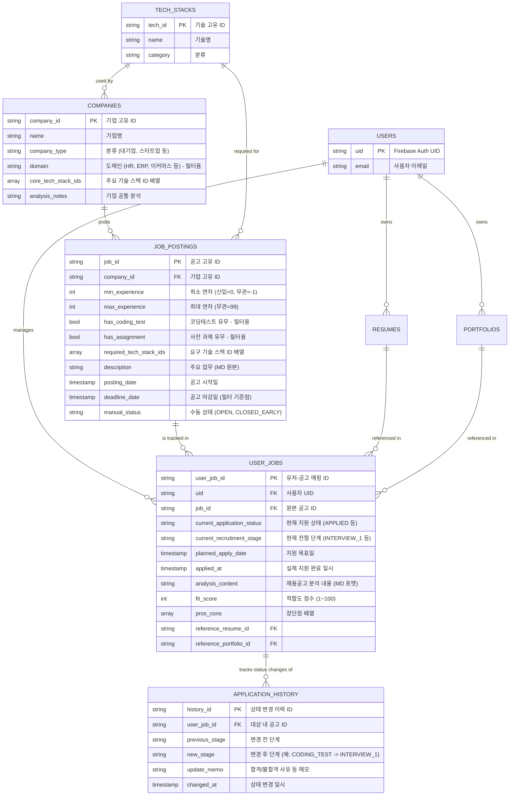

# Job Board Firestore ERD (Data Model)

기존 MD의 내용을 분석하여 **필터링 가능한 데이터를 모두 독립 필드로 추출**하였으며, 상태(Status) 값들의 이력 관리를 위해 **`APPLICATION_HISTORY`** 테이블을 별도로 분리한 고도화 모델입니다.

## 🗂️ 주요 변경 사항 설명 (V6)

### 1. 필터링 가능 데이터의 컬럼화 (MD 파싱)
기존 `recruitment_info.md` 텍스트 안에 뭉쳐 있던 요소들을 Firestore에서 완벽히 필터링(Where 절)할 수 있도록 쪼갰습니다.
*   **연차 필터링:** "3년 이상", "3~5년" 같은 텍스트를 `min_experience`와 `max_experience` 정수형(Int)으로 분리했습니다. (예: `where("min_experience", "<=", 3)`)
*   **전형 필터링:** 텍스트에 "코딩테스트"가 들어있으면 `has_coding_test: true` 컬럼으로 빼서, "코딩테스트 없는 기업만 보기" 같은 체크박스 필터가 가능해졌습니다.
*   **도메인 필터링:** 기업 테이블에 `domain` 필드를 추가하여 HR, ERP, 백오피스 등의 산업군 필터가 가능합니다.

### 2. 마감일 기반의 동적 상태 판별 (NoSQL 최적화)
질문하신 **"now()와 마감일을 비교해서 상태를 도출하는 것"**은 완벽한 정답입니다!
*   Firestore에서 쿼리할 때 `where("deadline_date", ">=", serverTimestamp())` 로 조회하면, 마감일이 안 지난 '지원 가능한 공고'만 즉시 뽑아낼 수 있습니다.
*   따라서 `status: OPEN/CLOSED` 필드는 굳이 시스템이 매분 매초 업데이트할 필요가 없으며, 오직 "기간은 남았는데 회사에서 조기 마감 시켜버렸을 때"를 대비한 수동 덮어쓰기용(`manual_status`)으로만 남겨두었습니다.

### 3. 상태 변경 이력 테이블(`APPLICATION_HISTORY`) 분리
"현재 지원 현황을 보여주는 상태값을 별도의 테이블로 뺄까?"라는 본인의 아이디어를 바탕으로 설계했습니다.
*   **`APPLICATION_HISTORY` (상태 변경 로그):** 서류 합격일, 1차 면접일, 탈락일 등 "언제 무슨 전형으로 상태가 바뀌었는지" 타임라인 히스토리를 쭉 쌓아둡니다.
*   **`USER_JOBS`의 현재 상태:** 다만 프론트엔드에서 리스트를 띄울 때마다 History 테이블을 뒤지면 NoSQL 읽기 비용(Read Ops)이 폭발합니다. 따라서 `USER_JOBS` 테이블에 **`current_application_status`**라는 필드를 남겨두고, 상태가 바뀔 때마다 이 필드만 최신 값으로 덮어씌우는 것(역정규화)이 파이어베이스 실무의 100점짜리 패턴입니다!
